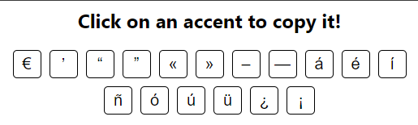

# Spanish accents

This extension allows you to copy Spanish accents.

Shift-click to copy the capitalized accent. 

## In order to download this extension:

1. Go to [the releases tab](https://github.com/Reallukeisbest/spanish-accents/releases/tag/Release/)
2. Scroll down and download the zip file under "assets"
3. Go to chrome://extensions/

4. Turn on Developer mode

5. Reload the page
6. Drag the zip file to the extensions page

7. Enjoy!
